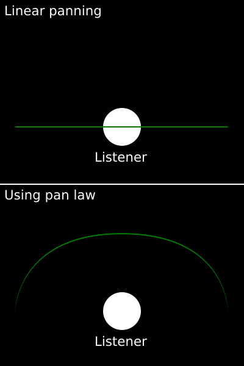

# Stereo Mixer

An LV2 audio plug-in for stereo-signal manipulation.

## Features

- Input/Output gain independent for each channel alongwith combined
- Wide
	- Wideness percent
	- Wide law
- Panning
	- Pan (percent of shifting between -100 and +100)
	- Pan law
	- Optional gain compensation for "pan law"

### What is the purpuse of “law” here?

For “wide” and “pan” knobs you have additional “law” correction knobs.

I would just refer to the Wikipedia: https://en.wikipedia.org/wiki/Pan_law

First paragraph from there states:

> **Pan law**, or **pan rule**, is a recording and mixing principle that states
> that any signal of equal amplitude and phase that is played in both channels
> of a stereo system will increase in loudness up to 6.02 dBSPL, provided there
> is perfect response in the loudspeaker system and perfect acoustics in the
> room.

My own impirical and subjective short explanation would be: it makes feeling of
an imaginary stage around you more round.

What I mean by that I could illustrate like this:



Where green line means line on which source of the sound would move around a
listener. The lower “pan law” value the further away from you source of the
sound when it just centered and the louder it is when it's panned to the left or
to the right. By extreme values you could obtain some interesting
psycho-acoustic effects for pan automation.

“Pan gain compensation (boost)” toggle turns on boost that makes volume of the
sound be the same when it's centered with any “pan law” value as “pan law” would
just be set to zero (but when you pan it volume will be as louder as “pan law”
value lower).

About “wide law”. Just think about this, when everything is linear (no “law”)
and you have identical two signals for left and right channels (just splitted
mono signal), and when you shrink wideness to the zero then what you get? You
get left and right channels panned to the center and since they're identical you
get just sum of them that means volume is doubled. In this case you may want use
“wide law” correction to compensate that to make volume be as less as wideness
is narrow.

And do not forget, you could set it to extreme values and automate “wide” knob
alongwith “pan” and by that produce some interesting experimental flows of your
mix. Some producers recommend to make a track be less wide when you want to make
it feels more away from a listener (but not only by that of course) and consider
that the lower “wide law” and “wide” values the less loud a signal so you could
make sound going far away just by moving “wide” knob (with very low “wide law”
value).

## How to build

Just run:

```bash
make
```

And you get `stereo-mixer.lv2` directory of the plug-in.

You could for example make symbolic link to it
in `/usr/local/lib64/lv2` directory or just copy it there:

```bash
cp -r stereo-mixer.lv2/ /usr/local/lib64/lv2/
```

You also may want to build _DEBUG_ version of the plug-in:

```bash
make DEBUG=Y
```

# Author

Viacheslav Lotsmanov

# License

[GPLv3](./LICENSE)
